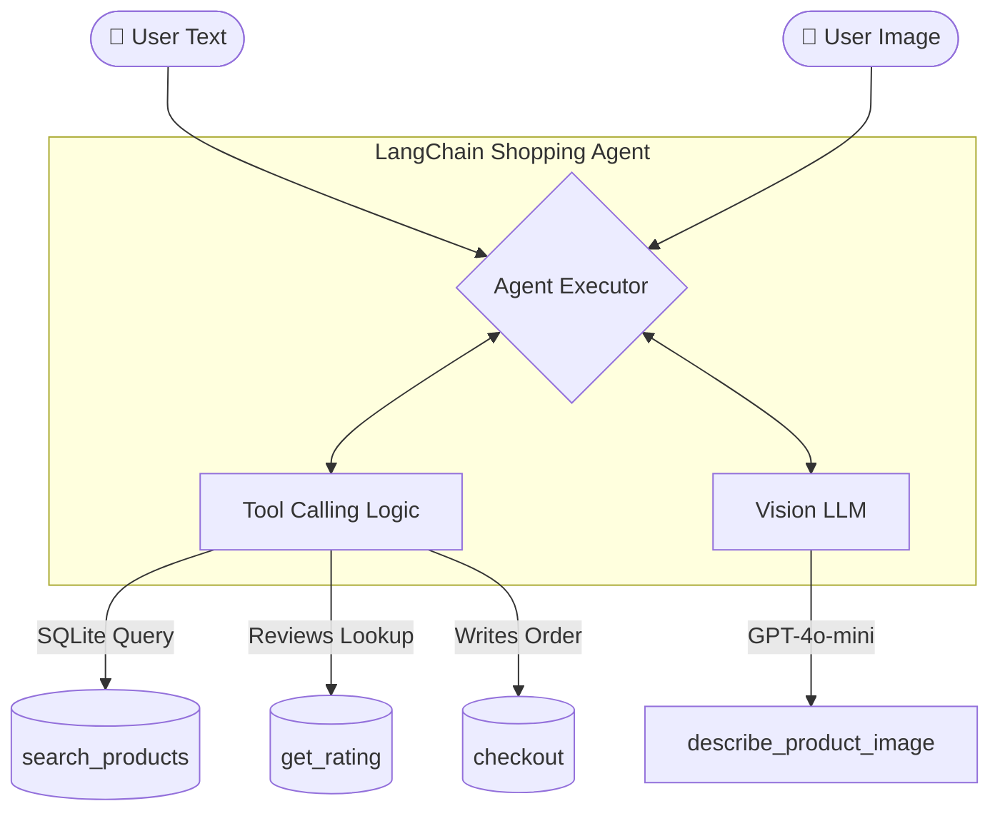

# 🛒 Multimodal Shopping Agent

An **AI-powered shopping assistant** built with **LangChain**, **tool calling**, and **multimodal reasoning**.  
The agent helps users discover products through **natural language** or **product images**, filters results by structured constraints such as **price**, **organic status**, and **minimum rating**, and completes the flow with a safe, confirmation-based **checkout** step.

> **Example Usage:**  
> *“I want organic honey under $20 with a 4.5+ rating”*  
> Or simply upload a product image and let the agent find similar items!

---

## Features

* **Natural-Language Shopping:** Understands free-form requests and extracts preferences (product type, max price, organic flag, minimum rating).
* **Image-Based Product Search:** Accepts a product photo, using a vision-capable LLM to identify attributes and convert them into a searchable query.
* **Tool-Augmented Retrieval:** Searches a SQLite product catalog with structured filters and retrieves ratings/review counts before ranking.
* **Rating-Aware Recommendations:** Evaluates candidate products with real review statistics based on user-defined thresholds.
* **Safe Checkout Flow:** Resolves products using IDs and **never** places an order without explicit user confirmation.
* **Interactive UI:** Includes a beautiful **Streamlit** interface for conversational shopping and image uploads.

---

## How It Works

The system is implemented as a **LangChain agent** with custom tools. Depending on the user’s input modality, the workflow branches into two paths:

### 1️⃣ Text-Based Shopping Flow
1. User describes a product in natural language.
2. The agent calls `search_products(...)` with optional filters.
3. For each matched product, the agent calls `get_rating(...)`.
4. The agent filters, ranks the results, and presents a numbered list.
5. If the user confirms, the agent calls `checkout(product_id)`.

### 2️⃣ Image-Based Shopping Flow
1. User uploads a product image.
2. The agent calls `describe_product_image(image_path)`.
3. The vision model extracts: *product type*, *search query*, *organic status*, and a *short description*.
4. The agent uses these extracted attributes to search the catalog.
5. The browsing and checkout flow continues as in text mode.

---

## Architecture

## Tech Stack

* **Agentic Framework:** LangChain (Agent Executor, Tool Decorators)
* **LLM (Reasoning):** `gapgpt-qwen-3.6` (via GapGPT API)
* **Vision LLM:** `gpt-4o-mini` (via GapGPT API)
* **Database:** SQLite3 (Catalog, Reviews, and Orders management)
* **Frontend:** Streamlit (Interactive UI)

---

## Getting Started

### Step 1: Clone the Repository
bash
git clone https://github.com/your-username/multimodal-shopping-agent.git
cd multimodal-shopping-agent

### Step 2: Environment Setup
Create and activate a Python virtual environment:
bash
python -m venv .venv

# On Windows:
.venv\Scripts\activate

# On macOS/Linux:
source .venv/bin/activate

### Step 3: Install Dependencies
bash
pip install langchain langchain-openai langchain-groq streamlit python-dotenv openai

### Step 4: Environment Configuration
Create a `.env` file in the root folder and add your API credentials:
env
OPENAI_API_KEY=your_api_key_here
OPENAI_BASE_URL=your_base_url_here

---

## Running the Project

**Option A: Launch the Web Interface (Recommended)**
bash
streamlit run app.py

**Option B: Run via Terminal (Agent Logic Only)**
bash
python shopping_agent.py

---

## Tool Specifications

| Tool Name | Description | Data Source |
| :--- | :--- | :--- |
| **`search_products`** | Uses SQL to find items based on name, category, price, and organic status. | SQLite (Catalog) |
| **`get_rating`** | Retrieves average stars and review counts for specific Product IDs. | SQLite (Reviews) |
| **`describe_product_image`** | Uses Vision AI to turn a photo into searchable text/attributes. | Vision LLM |
| **`checkout`** | Inserts a new record into the database to finalize the purchase. | SQLite (Orders) |

---

## Example Interaction Flows

### Scenario 1: Text Search
> **User:** "I want to buy organic honey with 4.5+ rating and less than $20."
> 
> **Agent:** 
> 1. Organic Forest Honey (ID:3) — $18.99 ★4.7
> 2. Pure Wild Honey (ID:8) — $19.50 ★4.5
> *Would you like to order one of these? Please provide the number.*
> 
> **User:** "Get me #1"
> 
> **Agent:** "Order #101 confirmed! 'Organic Forest Honey' has been ordered."

### Scenario 2: Image Search
> **User:** *(Uploads photo of a specific cereal box)*
> 
> **Agent:** *(Vision identifies: Cereal, Whole Grain, Brand X)*
> "I found 'Brand X Whole Grain Cereal' in our catalog. Would you like to see details or proceed to checkout?"

---

## Safety & Constraints

To ensure reliability, the agent is strictly constrained by the following rules:

* **No Ghost Orders:** The agent **cannot** execute the `checkout` tool without direct, explicit confirmation from the user.
* **No Hallucinations:** The agent is instructed to only use `product_id`s explicitly retrieved from the database tools.
* **Data Integrity:** All transactions and searches are securely logged and executed against the local SQLite database.
